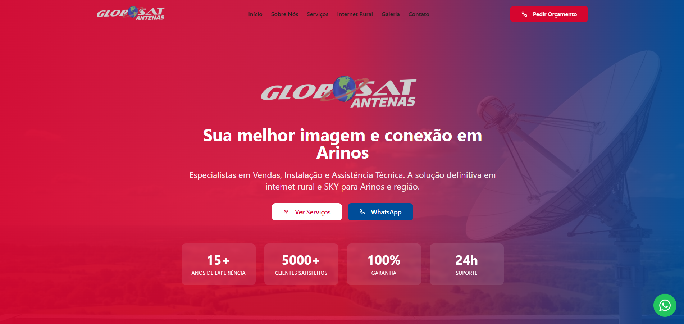

# 📡 Globo Sat Antenas - Conecta Arinos

<p align="center">
  
</p>

Website institucional moderno e responsivo desenvolvido para a **Globo Sat Antenas**, empresa referência em conectividade rural e segurança eletrônica em Arinos-MG e região.


## 🎯 Sobre o Projeto

Este projeto tem como objetivo apresentar os serviços da Globo Sat, facilitando o contato com clientes e exibindo o portfólio de instalações rurais e urbanas. O site foi otimizado para performance e conversão (vendas via WhatsApp).

### ✨ Funcionalidades Principais

* **Galeria Inteligente:** Sistema de fotos organizado por abas (Internet, Segurança, Frota, Loja) com visualização em tela cheia (Lightbox).
* **Destaque Starlink & HughesNet:** Seções dedicadas aos principais produtos de internet via satélite.
* **Design Responsivo:** Layout totalmente adaptado para celulares (Mobile First) e Desktops.
* **Call-to-Action:** Botões estratégicos para contato direto via WhatsApp.
* **Mapa Interativo:** Localização da loja física integrada com Google Maps.
* **Anti-Tradução:** Configurações meta-tags para impedir tradução automática indesejada pelo navegador.

## 🛠️ Tecnologias Utilizadas

O projeto foi construído utilizando as melhores práticas do desenvolvimento web moderno:

* **[React](https://react.dev/)** + **[Vite](https://vitejs.dev/)**: Para uma aplicação rápida e performática.
* **[TypeScript](https://www.typescriptlang.org/)**: Para maior segurança e organização do código.
* **[Tailwind CSS](https://tailwindcss.com/)**: Para estilização ágil e responsiva.
* **[shadcn/ui](https://ui.shadcn.com/)**: Biblioteca de componentes de interface de alta qualidade (Tabs, Cards, Dialogs).
* **[Lucide React](https://lucide.dev/)**: Ícones leves e modernos.
* **[Vercel](https://vercel.com/)**: Plataforma de hospedagem e deploy contínuo.

## 🚀 Como Rodar o Projeto Localmente

Siga estes passos para baixar e rodar o site no seu computador:

### Pré-requisitos
Você precisa ter o [Node.js](https://nodejs.org/) instalado.

### Passo a Passo

1.  **Clone o repositório:**
    ```bash
    git clone [https://github.com/seu-usuario/globosat-conecta-arinos.git](https://github.com/seu-usuario/globosat-conecta-arinos.git)
    ```

2.  **Entre na pasta do projeto:**
    ```bash
    cd globosat-conecta-arinos-main
    ```

3.  **Instale as dependências:**
    ```bash
    npm install
    # ou se usar bun
    bun install
    ```

4.  **Inicie o servidor de desenvolvimento:**
    ```bash
    npm run dev
    ```

5.  **Acesse no navegador:**
    O site estará rodando em: `http://localhost:8080` (ou a porta mostrada no terminal).

## 📂 Estrutura do Projeto

* `src/components`: Contém todos os blocos do site (Hero, Galeria, Serviços, Rodapé).
* `src/assets`: Onde ficam as imagens (logos, fotos da instalação, banners).
* `src/ui`: Componentes base do Shadcn (botões, cards, inputs).
* `public`: Arquivos estáticos como o `robots.txt` e favicon.

## 📝 Personalização e Manutenção

* **Alterar Fotos:** Adicione as imagens na pasta `src/assets` e atualize os imports no arquivo `src/components/Gallery.tsx`.
* **Alterar Textos:** Os textos estão diretamente nos arquivos dos componentes (ex: `Hero.tsx` para o texto inicial).
* **Cores:** A paleta de cores principal (Azul e Laranja) está configurada no arquivo `tailwind.config.ts`.

---

Desenvolvido com 💙 para conectar o campo à cidade.
